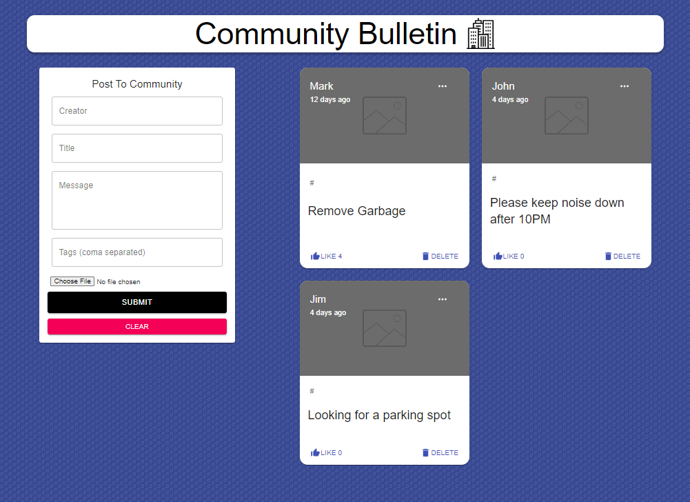

This is the opening page of a Condo Control management app. The opening page serves as a community bulletin board where residents can upload photos, comment, like, and delete posts, as well as tag various activities such as parking requests, complaints, and reminders. To expand its functionality, I would incorporate a free API, multiple pages (such as a resident directory and property management contacts), and more. Overall, it's a simple CRUD application based on the MERN stack.

This code is based on the learnings/content from Concordia Bootcamps, Traversy Media, The Net Ninja, JavaScript Mastery, Programming with Mosh, ChatGPT, Stack Overflow, and GeeksforGeeks.

